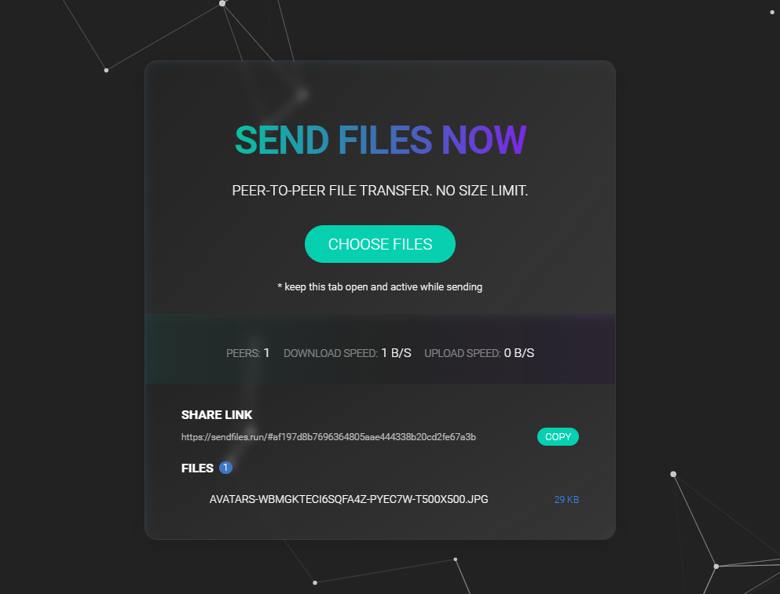
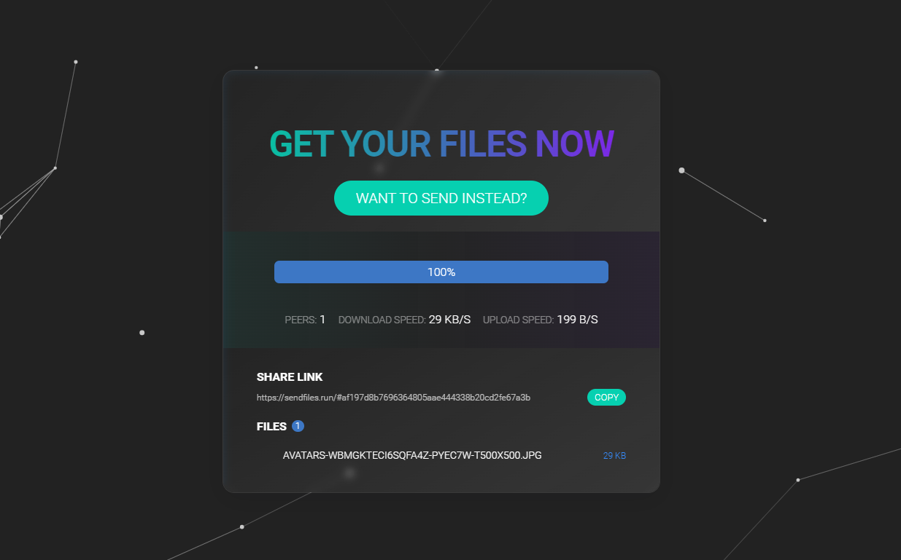

# SendFiles.run
Simple Peer-To-Peer file sharing in the browser, written in vanilla javascript.

Powered by *WebTorrent*.

## Demo

[sendfiles.run](https://sendfiles.run/)

## Usage

Choose file(s) to share and copy the share link.

Keep the sender tab active until another person downloads the files, because you are actively seeding them as a torrent.
If you close the tab before others get to receive them, they will not be available anymore.

**Obligatory Warning**:

*Do not click on Sendfiles links from strangers or websites you are not familiar with!!!*

## Screenshots

Sender example:

Receiver example:

## License

[MIT](LICENSE)
